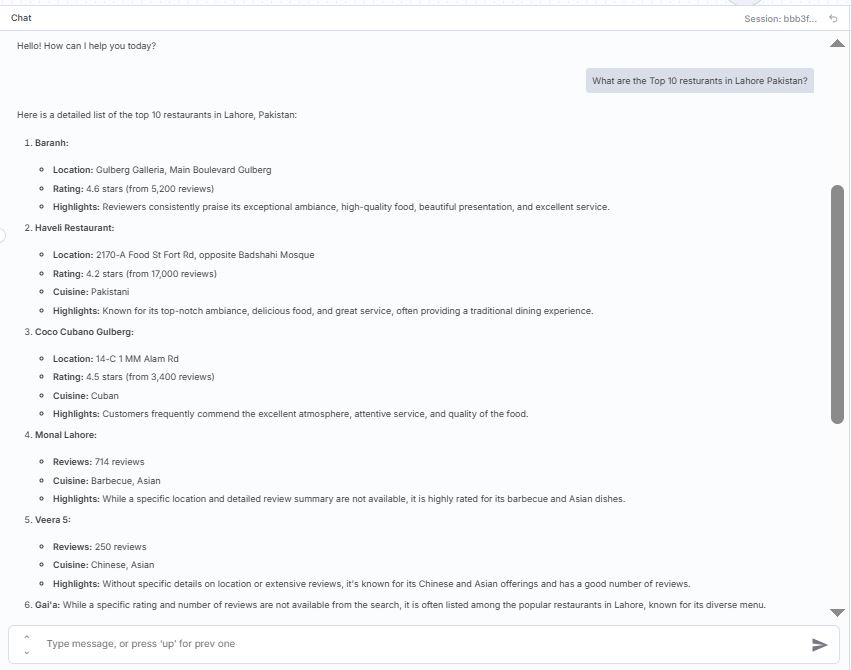
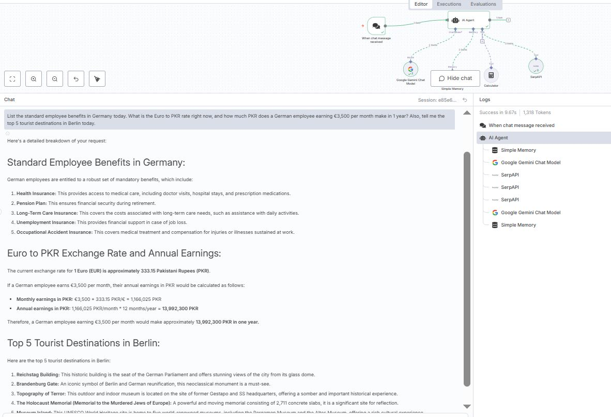

# AI-Powered-Real-Time-Chat-Agent-with-Web-Search-Memory-and-Calculations-n8n-Gemini-SerpAPI-
# 🤖 Serp AI Agent – n8n + Gemini + Pinecone + SerpAPI

A **Retrieval-Augmented Generation (RAG) AI Agent** built with **n8n**, **Google Gemini**, **Pinecone Vector Database**, and **SerpAPI**.  

This agent can:  
- Answer **real-time questions** with live web search  
- Retrieve **document-based knowledge** via Pinecone  
- Perform **calculations** automatically  
- Maintain **conversation memory**  
- Integrate with websites through a **chat widget**  

---

## 🌟 Features
- 🔍 **Document Retrieval (RAG)** using Pinecone  
- 💬 **Conversational AI** powered by Google Gemini Chat Model  
- 🌐 **Real-time Search** with SerpAPI for updated information  
- 🧮 **Mathematical Calculations** with n8n Calculator node  
- 🧠 **Conversation Memory** (Simple Memory Node)  
- ⚡ **Webhook Integration** for embedding into websites  
- 📊 **Multi-tool Orchestration** through n8n AI Agent node  

---

## 🛠️ Tech Stack
- [n8n](https://n8n.io/) – Workflow automation & orchestration  
- [Google Gemini](https://ai.google.dev/) – Chat + Embeddings  
- [Pinecone](https://www.pinecone.io/) – Vector database for semantic search  
- [SerpAPI](https://serpapi.com/) – Real-time search API  
- [Calculator Node (n8n)] – For numeric computation  

---

## 📸 Screenshots  

### Example 1 – Query about Top 10 Restaurants in Lahore  

---

### Example 2 – Germany Employee Benefits + Currency Conversion + Tourist Spots  

---

### Workflow Setup in n8n  

---

## 📂 Project Structure
