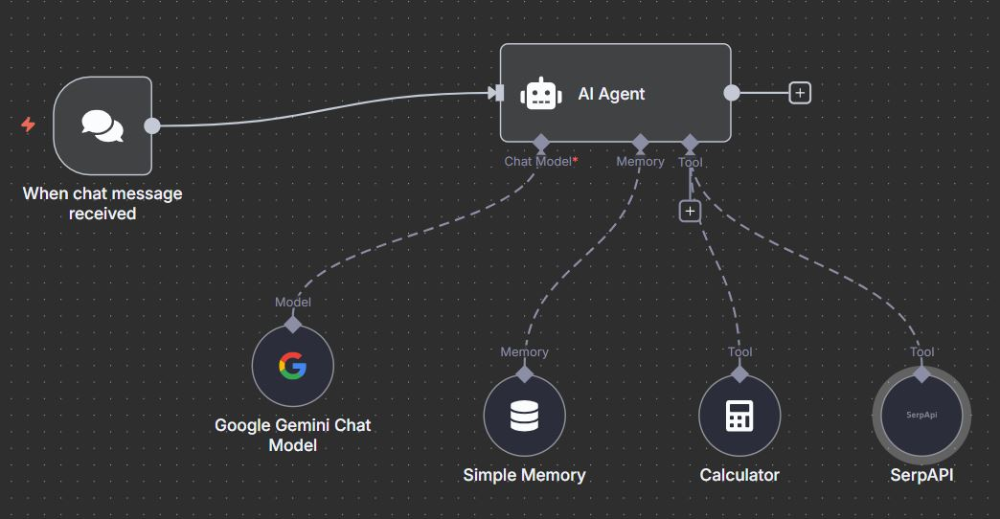

# 🤖 Serp AI Agent – n8n + Gemini + Pinecone + SerpAPI

# 🤖 Serp AI Agent – n8n + Gemini + SerpAPI  

A **Real-Time AI Agent** built with **n8n**, **Google Gemini**, and **SerpAPI**.  
This project demonstrates how to build an **AI Agent that answers real-time updated questions**, performs calculations, and maintains conversation context — all inside an **n8n workflow**.  



---

## 🌟 Features
- 💬 **Conversational AI** powered by Google Gemini Chat Model  
- 🌐 **Real-time Web Search** with SerpAPI (live Google search results)  
- 🧮 **Mathematical Calculations** using n8n Calculator node  
- 🧠 **Conversation Memory** with Simple Memory node  
- ⚡ **Webhook Integration** for embedding into websites (chat widget support)  
- 📊 **Multi-tool Orchestration** via n8n AI Agent node  

---

## 🛠️ Tech Stack
- [n8n](https://n8n.io/) – Workflow automation & orchestration  
- [Google Gemini](https://ai.google.dev/) – Conversational AI  
- [SerpAPI](https://serpapi.com/) – Real-time search API  
- [Calculator Node (n8n)] – For numeric computation  
- [Simple Memory (n8n)] – To maintain context across queries  

---

## 🚀 Setup Instructions  

### 1️⃣ Clone this repo  
```bash
git clone https://github.com/yourusername/serp-ai-agent.git
cd serp-ai-agent


### Example 1 – Query about Top 10 Restaurants in Lahore  


---

### Example 2 – Germany Employee Benefits + Currency Conversion + Tourist Spots  


---

### Workflow Setup in n8n  


---

## 📂 Project Structure
